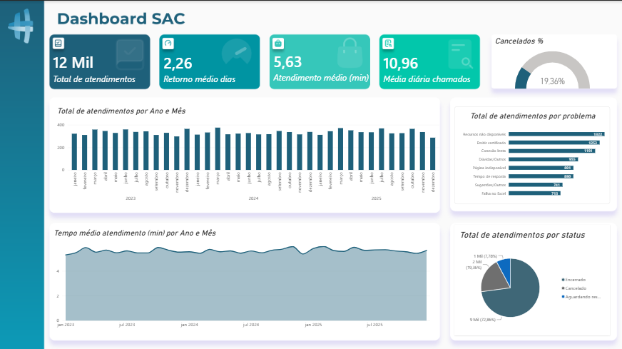

# 📊 Dashboard de Análise de Atendimentos

Projeto desenvolvido no Power BI para análise e acompanhamento de dados de atendimentos.

## 🎯 Objetivo

Criar um dashboard que permita visualizar os principais indicadores de atendimento e identificar padrões nos dados de forma simples e visual.

## 🛠️ Ferramentas utilizadas

- Power BI
- Power Query
- DAX
- Excel

## 📈 Dashboard

## 🔎 Análises realizadas

- Volume total de atendimentos
- Distribuição dos atendimentos
- Análise por categorias
- Indicadores de desempenho
- Visualização dos dados por meio de gráficos e filtros

## 📚 O que foi praticado

- Importação e tratamento de dados
- Transformação de dados utilizando Power Query
- Criação de medidas e indicadores
- Construção de visualizações
- Organização e apresentação de informações em um dashboard

## 📁 Arquivos

- `dashboard sac.pbix` — arquivo do projeto desenvolvido no Power BI
- `dashboard-sac.png` — imagem do dashboard
